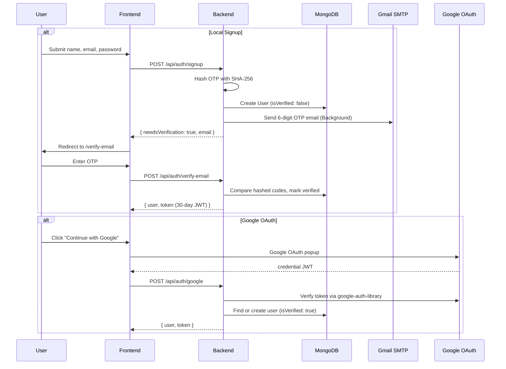
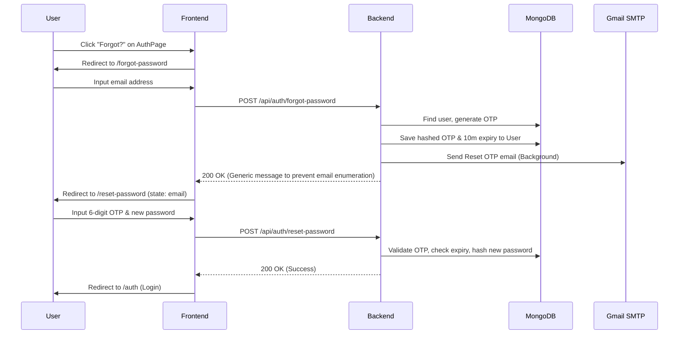

# 🏗️ Resumify: Single Source of Truth (SSOT) v3.1

> **Last Audited**: June 2026 — Every file, route, schema, and dependency verified against the live codebase.

This document serves as the authoritative technical reference for the **Resumify** project. It covers the architectural philosophy, data lifecycle, backend logic, frontend structure, database schemas, and a complete directory manifest.

---

## 1. System Philosophy & Methodology

### Architectural Pattern: MERN Personalization Hub
Resumify follows a **decoupled MERN (MongoDB, Express, React, Node.js) stack** architecture. The frontend (`client/`) and backend (`server/`) operate as independent entities communicating exclusively via a RESTful JSON API. This is a monorepo layout — not a monolith — enabling independent scaling of each tier.

### Stack Selection Rationale
| Technology | Why It Was Chosen |
|------------|-------------------|
| **MongoDB + Mongoose** | Document-oriented storage accommodates the variable structure of AI analysis results. The schema-less nature supports both rigid user profiles and flexible feedback arrays. |
| **Express.js + Node.js** | Minimal overhead for I/O-bound operations (file uploads, AI API calls). The middleware pipeline cleanly separates authentication, file validation, and business logic. |
| **React 19 + Vite** | Component-based architecture for complex, stateful UIs (score animations, drag-and-drop). Vite provides sub-second HMR for rapid iteration. |
| **Tailwind CSS v3** | Utility-first styling enabling a consistent glassmorphic dark/light theme without custom CSS bloat. |
| **Google Gemini 3.1 Flash Lite** | Fast, cost-effective model configured with structured JSON output via `responseSchema`. Lower latency and higher rate limits resolve quota restrictions for resume analysis and text humanization. |
| **Google Cloud Platform** | OAuth 2.0 integration for frictionless, trusted user onboarding. |
| **Nodemailer (Gmail SMTP)** | Zero-cost transactional email for OTP verification and password reset without third-party email service lock-in. |
| **Compression (Gzip/Brotli)** | Middleware applied to compress response payloads, accelerating client load times and saving bandwidth. |
| **Custom Sanitizer** | Replaces deprecated dependencies with Express 5-compatible parameter sanitization to block NoSQL injection vectors. |

### Core Problem Statement
The system bridges the **"Insight Gap"** in modern hiring. Most job seekers have no visibility into why their resume fails automated ATS filters. Resumify provides a transparent, AI-driven feedback loop with a **stateful career vault**, identity verification (Email OTP + Google OAuth), an **AI Humanizer** to rewrite machine-like patterns, and professional PDF report generation to track improvement over time.

---

## 2. Logical Flow & Data Lifecycle

### A. Authentication & Verification Flow



**Key Details:**
1. **Signup** creates an unverified user and dispatches a hashed 6-digit OTP (10-minute expiry) via Gmail SMTP in a non-blocking background task.
2. **Login** blocks unverified local accounts and auto-resends a new OTP. Google-only accounts are rejected from password login.
3. **Legacy Migration**: On server boot, `server.js` runs a one-time migration to mark all pre-verification-era users as `isVerified: true` to prevent lockouts.

---

### B. Forgot Password Flow



**Key Details:**
1. **Email Enumeration Mitigation**: The forgot-password endpoint returns a successful 200 response with a generic message even if the email does not exist in the database.
2. **Google OAuth Safety**: Accounts registered via Google OAuth are blocked from requesting password resets, returning a warning that Google Sign-in must be used.

---

### C. The "Life of an Analysis" (Targeted vs. General)

```
┌──────────────┐    multipart/form-data    ┌────────────────┐
│  Dashboard   │ ──────────────────────────>│  Multer        │
│  (React)     │   file + jobDescription   │  Middleware     │
└──────────────┘                           └───────┬────────┘
                                                   │ validates type & size
                                                   ▼
                                           ┌────────────────┐
                                           │ parseResume.js │
                                           │ (pdf-parse /   │
                                           │  mammoth)      │
                                           └───────┬────────┘
                                                   │ raw text (Async I/O)
                                                   ▼
                                           ┌────────────────┐
                                           │ analyzeWithAI  │
                                           │ (Gemini 3.1)   │
                                           │ Schema:        │
                                           │ targeted or    │
                                           │ general        │
                                           └───────┬────────┘
                                                   │ structured JSON
                                                   ▼
                                           ┌────────────────┐
                                           │ MongoDB        │
                                           │ • Analysis     │
                                           │ • Resume Vault │
                                           └───────┬────────┘
                                                   │
                                                   ▼
                                           ┌────────────────┐
                                           │ ResultsPage    │
                                           │ (Score, Skills,│
                                           │  PDF Export)   │
                                           └────────────────┘
```

**Step-by-step:**
1. **Ingestion**: `Dashboard.jsx` captures a file (drag-and-drop or browse) and an optional Job Description textarea.
2. **Multer Validation**: MIME type check (`application/pdf`, DOCX) and 5MB size limit. File stored temporarily in `uploads/`.
3. **Asynchronous Extraction**: `parseResume.js` extracts text using `pdf-parse` (PDF) or `mammoth` (DOCX) via asynchronous `fs.promises` to avoid event-loop blocking. A minimum 50-character threshold rejects image-based or empty PDFs.
4. **AI Analysis**: `analyzeWithAI.js` configures Gemini 3.1 Flash Lite with the appropriate JSON schema (`targetedSchema` with JD, or `generalSchema` without). Sends a weighted scoring prompt to Gemini. Score is clamped to `[0, 100]`.
5. **Persistence**: The `Analysis` record stores the scored result. The `Resume` Vault stores the raw extracted text (not the binary file) for future re-analysis without re-uploading. Vault updates run in the background to speed up response latency.
6. **Cleanup**: The temporary file is immediately deleted using asynchronous `fs.promises.unlink` in a `finally` block.
7. **Reporting**: On `ResultsPage.jsx`, users can export a professional PDF via `reportGenerator.js` which dynamically imports `jspdf` on-demand to optimize page load sizes.

---

### D. AI Humanizer Flow

```
┌─────────────────┐  import: paste,   ┌────────────────┐  POST /api/resume/humanize  ┌───────────────────┐
│ AIHumanizerPage │  upload, or vault  │ Parse / Select │ ──────────────────────────>│ humanizeAI.js     │
│ (React Workspace)│ ────────────────>│ Resume Text    │  Rate limit: 20 req / 15m  │ (Gemini 3.1 Lite) │
└─────────────────┘                    └────────────────┘                            └─────────┬─────────┘
        ▲                                                                                      │
        │                                                                                      │ Structured JSON
        │                                                                                      ▼
        │                              Comparative Document Review                    ┌───────────────────┐
        └─────────────────────────────────────────────────────────────────────────────│ Synchronized      │
                                       - Side-by-side scrolls (Feedback-free)         │ scroll view       │
                                       - Robotic patterns highlighted in Red          │ and Tabs          │
                                       - Humanized tone highlighted in Green          └───────────────────┘
```

**Step-by-step:**
1. **Input Stage**: The user enters text by pasting directly, uploading a file (processed by `/api/resume/parse` using async extraction and saved in vault), or pulling an existing document from the Vault.
2. **Optimization Pathway Selection**: 
   - **Specific Section** (e.g., job bullet, summary): Character limit 5,000.
   - **Overall Resume** (entire document structure): Character limit 15,000.
3. **Linguistic Optimization**: The backend processes the text via the `humanizeLimiter` and forwards it to Gemini 3.1 Flash Lite. The model evaluates the content for sentence length uniformity (burstiness), predictability (perplexity), and repetitive structures.
4. **Structured Rewrite**: Gemini returns a JSON payload matching `humanizeSchema` containing the restructured text, a list of tone/syntax/vocabulary recommendations, and an array of exact before-and-after replacements (`explanations`).
5. **Visualization**: The client renders the comparison side-by-side. Customized hook logic locks scrolling positions together synchronously, avoiding scroll feedback loops. Highlighting matches list indentation and flags robotic sections in red and humanized rewrites in green.

---

## 3. Deep-Dive Backend & Security Logic

### 3.1 Security Implementations
| Mechanism | Implementation | Detail |
|-----------|---------------|--------|
| **OTP Hashing** | `crypto.createHash('sha256')` | Verification codes and password reset codes are never stored in plaintext. Compared via hash match. |
| **Password Hashing** | `bcryptjs` (10 salt rounds) | Pre-save hook on the `User` model. Only runs when `password` is modified. |
| **JWT Protection** | `middleware/auth.js` | Extracts `Bearer` token, verifies with `JWT_SECRET`, attaches `req.user` for downstream handlers. |
| **Google Token Verification** | `google-auth-library` | Server-side `verifyIdToken()` prevents credential spoofing from the frontend. |
| **Sanitization** | Custom request sanitizer | Intercepts Express 5 payloads and strips potential NoSQL injection injection operators (e.g., `$`, `.`). |
| **Cascade Deletion** | `authController.deleteAccount` | Deletes all `Analysis` records for the user before deleting the `User` document, preventing orphaned data. |
| **Non-blocking Operations** | Unawaited Promise Chains | Email dispatches and vault write-backs are done as background promises (`.catch()`) so controller responses resolve immediately. |

### 3.2 API Structure

#### Auth Routes (`/api/auth`)
| Method | Endpoint | Handler | Auth | Description |
|--------|----------|---------|------|-------------|
| POST | `/signup` | `signup` | ❌ | Create account, hash OTP, send verification email |
| POST | `/verify-email` | `verifyEmail` | ❌ | Validate OTP, mark verified, issue JWT |
| POST | `/resend-code` | `resendCode` | ❌ | Generate and send a fresh OTP |
| POST | `/login` | `login` | ❌ | Authenticate with email/password |
| POST | `/google` | `googleLogin` | ❌ | OAuth login/signup via Google |
| POST | `/forgot-password` | `requestPasswordReset` | ❌ | Generate password reset OTP, send email |
| POST | `/reset-password` | `resetPassword` | ❌ | Validate OTP and set new password |
| GET | `/me` | `getMe` | ✅ | Fetch authenticated user profile (uses in-memory `req.user`) |
| PUT | `/profile` | `updateProfile` | ✅ | Update name, email, password, career defaults |
| DELETE | `/account` | `deleteAccount` | ✅ | Permanently delete account + all data |

#### Resume Routes (`/api/resume`)
| Method | Endpoint | Handler | Auth | Description |
|--------|----------|---------|------|-------------|
| POST | `/analyze` | `analyzeResume` | ✅ | Upload file + JD → AI analysis |
| POST | `/parse` | `parseResumeFile` | ✅ | Upload file (PDF/DOCX) → raw text, sync to vault |
| GET | `/history` | `getHistory` | ✅ | List all analyses (paginated, sorted newest first, excludes JD) |
| GET | `/vault` | `getVault` | ✅ | List vault items (excludes heavy `resumeText` body) |
| GET | `/vault/:id` | `getResumeById` | ✅ | Fetch single vault item details (includes full text) |
| GET | `/analysis/:id` | `getAnalysis` | ✅ | Fetch single analysis with full detail |
| DELETE | `/analysis/:id` | `deleteAnalysis` | ✅ | Remove a specific analysis |
| DELETE | `/vault/:id` | `deleteResume` | ✅ | Remove a resume from the vault |
| POST | `/humanize` | `humanizeText` | ✅ | Detect AI probability and rewrite text |

#### System Endpoint
| Method | Endpoint | Description |
|--------|----------|-------------|
| GET | `/api/health` | Returns `{ status: 'ok' }` — used for uptime monitoring |

### 3.3 Backend Utilities
| Utility | Purpose |
|---------|---------|
| `utils/parseResume.js` | Format-specific text extraction. PDF via `pdf-parse`, DOCX via `mammoth.extractRawText()`. Fully async via `fs.promises` to prevent event-loop delays. Auto-deletes temp files in `finally`. |
| `utils/analyzeWithAI.js` | Prompt-engineered Gemini 3.1 Flash Lite interface. Uses targeted/general JSON schemas with `responseMimeType: 'application/json'` for type-safe outputs. Handles date checking context. |
| `utils/humanizeAI.js` | Gemini 3.1 Flash Lite client configured with `humanizeSchema` for AI probability detection, linguistic analysis, and side-by-side translation arrays. |
| `utils/sendEmail.js` | Nodemailer transport (Gmail SMTP). Sends branded HTML emails for OTP verification (`sendVerificationEmail`) and password recovery (`sendPasswordResetEmail`). |

### 3.4 Middleware
| Middleware | File | Purpose |
|------------|------|---------|
| `protect` | `middleware/auth.js` | JWT verification gate. Populates `req.user` or returns 401. |
| `upload` (Multer) | Configured in `resumeController.js` | Disk storage to `uploads/`, MIME type filtering, 5MB limit. |
| `compression` | Imported in `server.js` | Compresses response payloads (Gzip/Brotli) to speed up server delivery. |
| Global Error Handler | `server.js` | Catches Multer errors (`LIMIT_FILE_SIZE`, invalid type) and generic server exceptions. |

#### Specialized Rate Limiters (`server.js`)
*   **Global Limiter**: `max: 200` requests per 15 minutes per IP.
*   **AI Analysis Limiter**: `/api/resume/analyze` restricted to `max: 10` requests per 15 minutes.
*   **Humanizer Limiter**: `/api/resume/humanize` restricted to `max: 20` requests per 15 minutes.
*   **Document Parse Limiter**: `/api/resume/parse` restricted to `max: 15` requests per 15 minutes.
*   **Auth Operations Limiter**: `/api/auth/signup`, `/verify-email`, `/resend-code`, `/forgot-password`, `/reset-password` restricted to `max: 5` requests per 10 minutes.

---

## 4. Frontend Architecture

### 4.1 Application Shell & Routing

To optimize the application's initial load size, all route pages are split and **lazy-loaded** using React's `lazy` and `Suspense` mechanism.

```
<AuthProvider>             ← React Context (user state, auth methods)
  <BrowserRouter>          ← react-router-dom v7
    <Suspense fallback={Spinner}>
      <Routes />
    </Suspense>
  </BrowserRouter>
</AuthProvider>
```

**Route Map:**
| Path | Component | Protected | Description |
|------|-----------|-----------|-------------|
| `/` | `LandingPage` | ❌ | Public marketing page with feature highlights |
| `/auth` | `AuthPage` | ❌ | Login/Signup with scoped Google OAuth Provider |
| `/verify-email` | `VerifyEmailPage` | ❌ | OTP input with resend and countdown logic |
| `/forgot-password` | `ForgotPasswordPage` | ❌ | Password reset request form |
| `/reset-password` | `ResetPasswordPage` | ❌ | Input recovery code and input new password |
| `/dashboard` | `Dashboard` | ✅ | File upload hub + recent analyses (limit 5) |
| `/analysis/:id` | `ResultsPage` | ✅ | Full analysis visualization + PDF export |
| `/profile` | `ProfilePage` | ✅ | Career defaults, account settings, delete account |
| `/resumes` | `MyResumesPage` | ✅ | Vault & History tabs with lazy-loaded cache |
| `/humanizer` | `AIHumanizerPage` | ✅ | Synchronized side-by-side comparative editor |

### 4.2 State Management

**`AuthContext.jsx`** — Provides the following globally:
*   `login(email, password)`: POST `/auth/login` → stores token + sets user
*   `signup(name, email, password)`: POST `/auth/signup` → returns verification trigger
*   `verifyEmail(email, code)`: POST `/auth/verify-email` → stores token + sets user
*   `googleLogin(credential)`: POST `/auth/google` → stores token + sets user
*   `requestPasswordReset(email)`: POST `/auth/forgot-password` → sends code
*   `resetPassword(email, code, newPassword)`: POST `/auth/reset-password` → updates credential
*   `logout()`: Clears `localStorage` and nullifies user state
*   `updateUser(data)`: In-memory profile updater

**`PrivateRoute.jsx`** — Route protection gate. Checks authentication token status before rendering child components.

**Google OAuth Optimization**: `<GoogleOAuthProvider>` was removed from the global app shell and placed specifically in `AuthPage.jsx` surrounding the button. This prevents importing Google auth bundle code until the user visits the login screen.

### 4.3 Page Components (stitch-ui/)
*   **`LandingPage.jsx`**: Public showcase page detailing ATS checking and humanizing tools.
*   **`AuthPage.jsx`**: Handles authentication forms and Google Sign-In button.
*   **`VerifyEmailPage.jsx`**: 6-digit OTP entry form for account verification.
*   **`ForgotPasswordPage.jsx`** [NEW]: UI for requesting a password reset email.
*   **`ResetPasswordPage.jsx`** [NEW]: Multi-field OTP entry screen for entering the recovery code and specifying a new secure password.
*   **`AIHumanizerPage.jsx`** [NEW]: Side-by-side comparison workspace. Offers fuzzy highlight matching (retaining list indentation, marking robotic texts in red and corrected texts in green), scroll synchronization, tone/syntax/vocabulary suggestions tabs, and file/vault imports.
*   **`Dashboard.jsx`**: File drag-drop panel, optional JD inputs, and quick metrics. Queries history with `?limit=5` and reads the custom `X-Total-Count` header to display total stats.
*   **`MyResumesPage.jsx`**: Tabbed interface splits history lists and Vault files. Uses tab-level lazy fetching and client caching (`hasFetchedVault` / `hasFetchedHistory`) to avoid duplicate API requests.
*   **`Navbar.jsx`**: Navigation bar featuring theme toggler (light/dark mode) and user menu dropdowns.
*   **`Sidebar.jsx`**: Icon-based navigation sidebar; now includes the **AI Humanizer** workspace.
*   **`HelpModal.jsx`**: Help overlay detail window explaining ATS scoring weights.

### 4.4 Frontend Utilities
*   **`api/axiosConfig.js`**: Axios config intercepting client calls and auto-appending Bearer tokens.
*   **`utils/reportGenerator.js`**: High-fidelity PDF compiler using `html2canvas`. Optimized with dynamic import (`await import('jspdf')`) to keep the primary JS bundle size lean.
*   **`client/vercel.json`** [NEW]: Configures Vercel edge deployment routes for single-page routing (SPA fallback) and serves static `/assets/` files with immutable long-term cache headers.

---

## 5. Database & Persistence (Mongoose Schemas)

### 5.1 User Entity
```javascript
{
  name:                      String,        // Required, trimmed
  email:                     String,        // Required, unique, lowercase
  password:                  String,        // Optional (null for Google users), min 6 chars
  authProvider:              String,        // enum: ['local', 'google'], default: 'local'
  googleId:                  String,        // Google sub ID (optional)
  avatar:                    String,        // Google profile picture URL (optional)
  careerDefaults: {
    targetRole:              String,        // e.g. "Frontend Developer"
    industry:                String,        // e.g. "Technology"
    experienceLevel:         String,        // e.g. "Mid-Level"
  },
  isVerified:                Boolean,       // default: false
  verificationCode:          String,        // SHA-256 hashed OTP (cleared after verification)
  verificationCodeExpires:   Date,          // 10 minutes from generation
  resetPasswordCode:         String,        // SHA-256 hashed password reset OTP
  resetPasswordExpires:      Date,          // 10 minutes from generation
  createdAt:                 Date,          // default: Date.now
}
```
**Hooks:** `pre('save')` — hashes password via `bcryptjs` (10 rounds) only when modified.

---

### 5.2 Analysis Entity
```javascript
{
  user:            ObjectId,    // ref: 'User', required — owner reference
  fileName:        String,      // required — original upload filename
  jobDescription:  String,      // required — full JD text or "General ATS Compatibility Check"
  jobTitle:        String,      // default: 'Not specified' — extracted by AI
  atsScore:        Number,      // required, min: 0, max: 100
  suggestions:     [String],    // AI-generated improvement tips
  missingSkills:   [String],    // Skills in JD but not in resume (or ATS issues for general)
  matchedSkills:   [String],    // Skills found in both JD and resume
  strengths:       [String],    // Strong points identified by AI
  analyzedAt:      Date,        // default: Date.now
}
```

---

### 5.3 Resume Entity (Vault)
```javascript
{
  user:        ObjectId,    // ref: 'User', required — owner reference
  fileName:    String,      // required — original upload filename
  resumeText:  String,      // required — full extracted plaintext (NOT the binary file)
  createdAt:   Date,        // default: Date.now
}
```
**Indexes:**
*   `resumeSchema.index({ user: 1, fileName: 1 }, { unique: true })`: Prevents duplicate records per user resume file.
*   `resumeSchema.index({ user: 1, createdAt: -1 })`: Speeds up sorted Vault queries.

---

## 6. File-by-File Directory Manifest (v3.1)

### 📁 Root (`/`)
*   `PROJECT_ARCHITECTURE.md`: This file — the v3.1 Single Source of Truth.
*   `README.md`: Setup manual and overview.
*   `.gitignore`: Excludes dependency folders, environment files, local logs, and `[Cc]laude.md`.
*   `package.json`: Workspace descriptor.

### 📁 Server (`server/`)
*   `server.js`: Express entry point configuring secure headers, rate limits, payload compression, routes, error handling, and pre-verification migration.
*   `config/db.js`: Mongoose connector.
*   `middleware/auth.js`: Protected JWT verification layer.
*   `controllers/authController.js`: Account handlers: signup, verification, login, OAuth, profile updates, and password reset flows.
*   `controllers/resumeController.js`: Document handlers: upload parsed assets, history limits/headers, vault queries, and AI Humanizer routing.
*   `routes/authRoutes.js`: Maps auth request endpoints.
*   `routes/resumeRoutes.js`: Maps resume evaluation and humanization endpoints.
*   `models/User.js`: Identity and recovery credentials model.
*   `models/Analysis.js`: Scored analysis results schema.
*   `models/Resume.js`: Text vault store schema with query indexes.
*   `utils/parseResume.js`: Async file extractor supporting PDF and DOCX.
*   `utils/analyzeWithAI.js`: ATS evaluator using Gemini 3.1 Flash Lite.
*   `utils/humanizeAI.js` [NEW]: Gemini 3.1 Flash Lite text optimizer and AI detector.
*   `utils/sendEmail.js`: Email dispatch routines for verification and reset OTPs.

### 📁 Client (`client/`)
*   `vercel.json` [NEW]: SPA fallback routing rules and static file cache directives.
*   `src/main.jsx`: React compiler mount element.
*   `src/App.jsx`: Router mapping containing lazy-loaded layout pathways and Suspense loading spinner.
*   `src/context/AuthContext.jsx`: global user session variables.
*   `src/api/axiosConfig.js`: Client HTTP interceptor appending authorization tokens.
*   `src/components/PrivateRoute.jsx`: Route guard.
*   `src/utils/reportGenerator.js`: PDF export compiler optimized with dynamic `jspdf` importing.

#### UI Components (`src/components/stitch-ui/`)
*   `LandingPage.jsx`: Public presentation homepage.
*   `AuthPage.jsx`: Sign-in forms with scoped Google OAuth wrapper.
*   `VerifyEmailPage.jsx`: Verification PIN keypad.
*   `ForgotPasswordPage.jsx` [NEW]: Recovery request form.
*   `ResetPasswordPage.jsx` [NEW]: Verification PIN and new password credential submission.
*   `AIHumanizerPage.jsx` [NEW]: Side-by-side workspace comparison.
*   `Dashboard.jsx`: Upload portal fetching history with `limit=5` and header statistics.
*   `MyResumesPage.jsx`: Vault and History management tabs with tab-lazy fetch and client caching.
*   `Navbar.jsx`: Theme controls and profile settings header.
*   `Sidebar.jsx`: Main menu navigation.
*   `HelpModal.jsx`: ATS guidelines help modal.

---

## 7. Dependencies & Environment

### 7.1 Backend Dependencies (`server/package.json`)
*   `express` (`^5.2.1`): Next-gen Express routing.
*   `mongoose` (`^9.3.3`): MongoDB ODM.
*   `compression` (`^1.8.0`) [NEW]: Response compression middleware.
*   `@google/generative-ai` (`^0.24.1`): Gemini AI SDK.
*   `google-auth-library` (`^10.6.2`): Google ID token helper.
*   `nodemailer` (`^8.0.5`): SMTP email library.
*   `jsonwebtoken` (`^9.0.3`): JWT signature engine.
*   `bcryptjs` (`^3.0.3`): Password encryption.
*   `multer` (`^2.1.1`): Multipart upload library.
*   `pdf-parse` (`^1.1.1`): PDF extraction.
*   `mammoth` (`^1.12.0`): DOCX extraction.
*   `cors` (`^2.8.6`): CORS interceptor.
*   `dotenv` (`^17.4.0`): Environment variable loader.

### 7.2 Frontend Dependencies (`client/package.json`)
*   `react` (`^19.2.4`) & `react-dom` (`^19.2.4`): Core React libraries.
*   `react-router-dom` (`^7.14.0`): Routing provider.
*   `@react-oauth/google` (`^0.13.5`): Google Auth helper.
*   `axios` (`^1.14.0`): HTTP requests.
*   `html2canvas` (`^1.4.1`): DOM-to-canvas rendering.
*   `jspdf` (`^4.2.1`): PDF builder (lazy-loaded).
*   `lucide-react` (`^1.7.0`): Vector icons.
*   `tailwindcss` (`^3.4.19`): Main CSS toolkit.
*   `vite` (`^8.0.4`): Build and dev server.

### 7.3 Environment Configuration (`.env`)
*   `MONGO_URI` (Required): Database connection string.
*   `JWT_SECRET` (Required): Encryption signature salt.
*   `GEMINI_API_KEY` (Required): Google Generative AI credentials.
*   `GOOGLE_CLIENT_ID` (Required): Scoped Google OAuth application ID.
*   `EMAIL_USER` (Required): Host email address.
*   `EMAIL_PASS` (Required): Host SMTP application access password.
