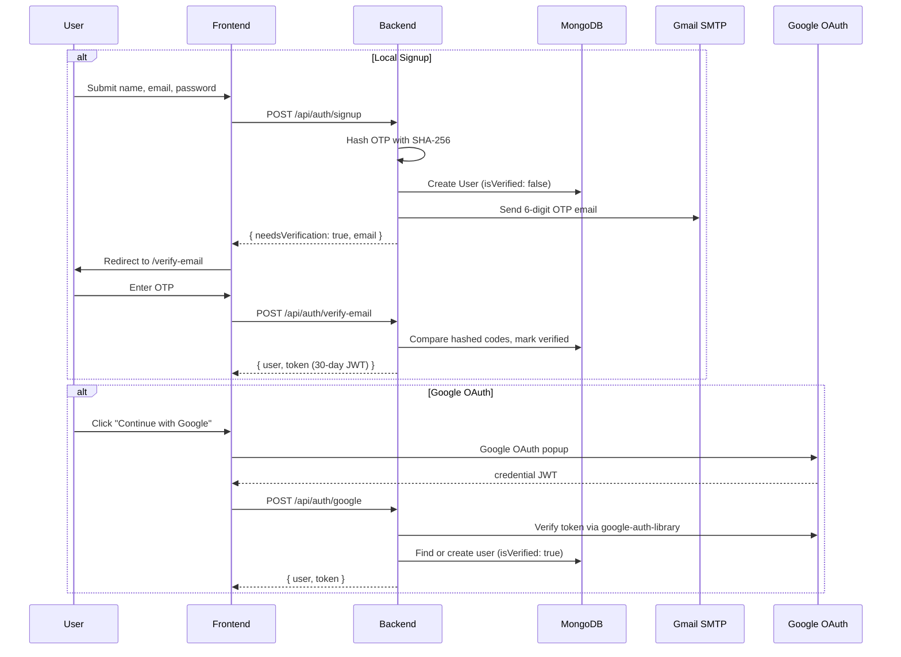

# 🏗️ Resumify: Single Source of Truth (SSOT) v3.0

> **Last Audited**: May 2026 — Every file, route, schema, and dependency verified against the live codebase.

This document serves as the authoritative technical reference for the **Resumify** project. It covers the architectural philosophy, data lifecycle, backend logic, frontend structure, database schemas, and a complete directory manifest.

---

## 1. System Philosophy & Methodology

### Architectural Pattern: MERN Personalization Hub
Resumify follows a **decoupled MERN (MongoDB, Express, React, Node.js) stack** architecture. The frontend (`client/`) and backend (`server/`) operate as independent entities communicating exclusively via a RESTful JSON API. This is a monorepo layout — not a monolith — enabling independent scaling of each tier.

### Stack Selection Rationale
| Technology | Why It Was Chosen |
|------------|-------------------|
| **MongoDB + Mongoose** | Document-oriented storage accommodates the variable structure of AI analysis results. The schema-less nature supports both rigid user profiles and flexible feedback arrays. |
| **Express.js + Node.js** | Minimal overhead for I/O-bound operations (file uploads, AI API calls). The middleware pipeline cleanly separates authentication, file validation, and business logic. |
| **React 19 + Vite** | Component-based architecture for complex, stateful UIs (score animations, drag-and-drop). Vite provides sub-second HMR for rapid iteration. |
| **Tailwind CSS v3** | Utility-first styling enabling a consistent glassmorphic dark/light theme without custom CSS bloat. |
| **Google Gemini 2.5 Flash** | Structured JSON output via `responseSchema` ensures AI feedback maps directly to frontend components without post-processing. Deterministic via `temperature: 0`. |
| **Google Cloud Platform** | OAuth 2.0 integration for frictionless, trusted user onboarding. |
| **Nodemailer (Gmail SMTP)** | Zero-cost transactional email for OTP verification without third-party email services. |

### Core Problem Statement
The system bridges the **"Insight Gap"** in modern hiring. Most job seekers have no visibility into why their resume fails automated ATS filters. Resumify provides a transparent, AI-driven feedback loop with a **stateful career vault**, identity verification (Email OTP + Google OAuth), and professional PDF report generation to track improvement over time.

---

## 2. Logical Flow & Data Lifecycle

### A. Authentication & Verification Flow



**Key Details:**
1. **Signup** creates an unverified user and dispatches a hashed 6-digit OTP (10-minute expiry) via Gmail SMTP.
2. **Login** blocks unverified local accounts and auto-resends a new OTP. Google-only accounts are rejected from password login.
3. **Legacy Migration**: On server boot, `server.js` runs a one-time migration to mark all pre-verification-era users as `isVerified: true` to prevent lockouts.

### B. The "Life of an Analysis" (Targeted vs. General)

```
┌──────────────┐    multipart/form-data    ┌────────────────┐
│  Dashboard   │ ──────────────────────────>│  Multer        │
│  (React)     │   file + jobDescription   │  Middleware     │
└──────────────┘                           └───────┬────────┘
                                                   │ validates type & size
                                                   ▼
                                           ┌────────────────┐
                                           │ parseResume.js │
                                           │ (pdf-parse /   │
                                           │  mammoth)      │
                                           └───────┬────────┘
                                                   │ raw text
                                                   ▼
                                           ┌────────────────┐
                                           │ analyzeWithAI  │
                                           │ (Gemini API)   │
                                           │ Schema:        │
                                           │ targeted or    │
                                           │ general        │
                                           └───────┬────────┘
                                                   │ structured JSON
                                                   ▼
                                           ┌────────────────┐
                                           │ MongoDB        │
                                           │ • Analysis     │
                                           │ • Resume Vault │
                                           └───────┬────────┘
                                                   │
                                                   ▼
                                           ┌────────────────┐
                                           │ ResultsPage    │
                                           │ (Score, Skills,│
                                           │  PDF Export)   │
                                           └────────────────┘
```

**Step-by-step:**
1. **Ingestion**: `Dashboard.jsx` captures a file (drag-and-drop or browse) and an optional Job Description textarea.
2. **Multer Validation**: MIME type check (`application/pdf`, DOCX) and 5MB size limit. File stored temporarily in `uploads/`.
3. **Text Extraction**: `parseResume.js` dispatches to `pdf-parse` (PDF) or `mammoth` (DOCX). Text is normalized (whitespace collapsed, line endings standardized). A minimum 50-character threshold rejects image-based or empty PDFs.
4. **AI Analysis**: `analyzeWithAI.js` selects the appropriate JSON schema (`targetedSchema` with JD, or `generalSchema` without). Sends a weighted scoring prompt to Gemini. Score is clamped to `[0, 100]`.
5. **Persistence**: The `Analysis` record stores the scored result. The `Resume` Vault stores the raw extracted text (not the binary file) for future re-analysis without re-uploading.
6. **Cleanup**: The temporary file is immediately `unlink`'d from `uploads/` regardless of success or failure (via `finally` block).
7. **Reporting**: On `ResultsPage.jsx`, users can export a professional PDF via `reportGenerator.js` (DOM capture → paginated A4 PDF).

---

## 3. Deep-Dive Backend & Security Logic

### 3.1 Security Implementations
| Mechanism | Implementation | Detail |
|-----------|---------------|--------|
| **OTP Hashing** | `crypto.createHash('sha256')` | Codes are never stored in plaintext. Compared via hash match. |
| **Password Hashing** | `bcryptjs` (10 salt rounds) | Pre-save hook on the `User` model. Only runs when `password` is modified. |
| **JWT Protection** | `middleware/auth.js` | Extracts `Bearer` token, verifies with `JWT_SECRET`, attaches `req.user` for downstream handlers. |
| **Google Token Verification** | `google-auth-library` | Server-side `verifyIdToken()` prevents credential spoofing from the frontend. |
| **Cascade Deletion** | `authController.deleteAccount` | Deletes all `Analysis` records for the user before deleting the `User` document, preventing orphaned data. |

### 3.2 API Structure

#### Auth Routes (`/api/auth`)
| Method | Endpoint | Handler | Auth | Description |
|--------|----------|---------|------|-------------|
| POST | `/signup` | `signup` | ❌ | Create account, hash OTP, send verification email |
| POST | `/verify-email` | `verifyEmail` | ❌ | Validate OTP, mark verified, issue JWT |
| POST | `/resend-code` | `resendCode` | ❌ | Generate and send a fresh OTP |
| POST | `/login` | `login` | ❌ | Authenticate with email/password |
| POST | `/google` | `googleLogin` | ❌ | OAuth login/signup via Google |
| GET | `/me` | `getMe` | ✅ | Fetch authenticated user profile |
| PUT | `/profile` | `updateProfile` | ✅ | Update name, email, password, career defaults |
| DELETE | `/account` | `deleteAccount` | ✅ | Permanently delete account + all data |

#### Resume Routes (`/api/resume`)
| Method | Endpoint | Handler | Auth | Description |
|--------|----------|---------|------|-------------|
| POST | `/analyze` | `analyzeResume` | ✅ | Upload file + JD → AI analysis |
| GET | `/history` | `getHistory` | ✅ | List all analyses (newest first, no JD text) |
| GET | `/vault` | `getVault` | ✅ | List all stored resume texts |
| GET | `/analysis/:id` | `getAnalysis` | ✅ | Fetch single analysis with full detail |
| DELETE | `/analysis/:id` | `deleteAnalysis` | ✅ | Remove a specific analysis |
| DELETE | `/vault/:id` | `deleteResume` | ✅ | Remove a resume from the vault |

#### System Endpoint
| Method | Endpoint | Description |
|--------|----------|-------------|
| GET | `/api/health` | Returns `{ status: 'ok' }` — used for uptime monitoring |

### 3.3 Backend Utilities
| Utility | Purpose |
|---------|---------|
| `utils/parseResume.js` | Format-specific text extraction. PDF via `pdf-parse`, DOCX via `mammoth.extractRawText()`. Auto-deletes temp files in `finally`. |
| `utils/analyzeWithAI.js` | Prompt-engineered Gemini interface. Uses two distinct JSON schemas (`targetedSchema` / `generalSchema`) with `responseMimeType: 'application/json'` for type-safe output. |
| `utils/sendEmail.js` | Nodemailer transport (Gmail SMTP). Sends branded HTML emails with the 6-digit OTP and a 10-minute expiry notice. |

### 3.4 Middleware
| Middleware | File | Purpose |
|------------|------|---------|
| `protect` | `middleware/auth.js` | JWT verification gate. Populates `req.user` or returns 401. |
| `upload` (Multer) | Configured in `resumeController.js` | Disk storage to `uploads/`, MIME type filtering, 5MB limit. |
| Global Error Handler | `server.js` | Catches Multer-specific errors (`LIMIT_FILE_SIZE`, invalid type) and generic server errors. |

---

## 4. Frontend Architecture

### 4.1 Application Shell & Routing

The app is wrapped in two providers:
```
<GoogleOAuthProvider>     ← @react-oauth/google (Client ID)
  <AuthProvider>          ← React Context (user state, auth methods)
    <BrowserRouter>       ← react-router-dom v7
      <Routes />
    </BrowserRouter>
  </AuthProvider>
</GoogleOAuthProvider>
```

**Route Map:**
| Path | Component | Protected | Description |
|------|-----------|-----------|-------------|
| `/` | `LandingPage` | ❌ | Public marketing page with feature highlights |
| `/auth` | `AuthPage` | ❌ | Multi-mode Login/Signup form with Google OAuth |
| `/verify-email` | `VerifyEmailPage` | ❌ | OTP input with resend and countdown logic |
| `/dashboard` | `Dashboard` | ✅ | File upload hub + recent analysis history |
| `/analysis/:id` | `ResultsPage` | ✅ | Full analysis visualization + PDF export |
| `/profile` | `ProfilePage` | ✅ | Career defaults, account settings, delete account |
| `/resumes` | `MyResumesPage` | ✅ | Resume vault + analysis history tabs |

### 4.2 State Management

**`AuthContext.jsx`** — Provides the following globally:
| Method | Behavior |
|--------|----------|
| `login(email, password)` | POST `/auth/login` → stores token + sets user |
| `signup(name, email, password)` | POST `/auth/signup` → returns response (no token yet) |
| `verifyEmail(email, code)` | POST `/auth/verify-email` → stores token + sets user |
| `googleLogin(credential)` | POST `/auth/google` → stores token + sets user |
| `logout()` | Clears `localStorage` token and nullifies user state |
| `updateUser(data)` | In-memory user state update (after profile edits) |

**`PrivateRoute.jsx`** — Wraps protected routes. Shows a loading spinner while `AuthContext` validates the stored JWT on mount, then either renders children or redirects to `/auth`.

### 4.3 Page Components (stitch-ui/)
| Component | Lines | Responsibility |
|-----------|-------|----------------|
| **`LandingPage.jsx`** | ~150 | Public hero section with feature cards, testimonials, and CTA buttons to `/auth`. |
| **`AuthPage.jsx`** | ~200 | Dual-mode form (Login/Signup) with field validation. Integrates Google OAuth button. Redirects to `/verify-email` on signup. |
| **`VerifyEmailPage.jsx`** | ~250 | 6-digit OTP input grid with auto-focus advance. Resend code button with cooldown timer. Handles expired/invalid code errors. |
| **`Dashboard.jsx`** | ~260 | Drag-and-drop file upload zone, optional JD textarea, recent analysis cards with quick-view/download/delete actions. Account usage stats sidebar. |
| **`ResultsPage.jsx`** | ~300 | ATS score gauge, matched/missing skill tags, strength highlights, suggestion list, and PDF report download button. |
| **`ProfilePage.jsx`** | ~400 | Three-section layout: Personal Info editing, Career Defaults (target role, industry, experience level), and Danger Zone (password change, account deletion with confirmation). |
| **`MyResumesPage.jsx`** | ~280 | Tabbed interface: "History" tab lists past analyses, "Vault" tab manages stored resume texts. Both support delete actions. |
| **`Navbar.jsx`** | ~170 | Top navigation bar with logo, theme toggle (dark/light), and user avatar dropdown (Profile, My Resumes, Logout). Responsive. |
| **`Sidebar.jsx`** | ~70 | Left sidebar with icon-based navigation links (Dashboard, My Resumes, Help). Active tab highlighting. |
| **`HelpModal.jsx`** | ~140 | Overlay modal triggered from Sidebar. FAQ-style accordion explaining how to use the platform, file requirements, and scoring methodology. |

### 4.4 Frontend Utilities
| Utility | Purpose |
|---------|---------|
| **`api/axiosConfig.js`** | Centralized Axios instance with `baseURL: '/api'`. Request interceptor auto-attaches `Bearer` token from `localStorage` to every outgoing request. |
| **`utils/reportGenerator.js`** | DOM-to-PDF export engine. Uses `html2canvas` (scale: 2, locked width: 1200px) for high-fidelity capture. `jsPDF` handles A4 pagination with 15mm margins. Dynamically adapts background color to the user's current dark/light theme. Hides `.no-print` elements and reveals `[data-pdf-only]` elements during capture. |

---

## 5. Database & Persistence (Mongoose Schemas)

### 5.1 User Entity
```javascript
{
  name:                      String,        // Required, trimmed
  email:                     String,        // Required, unique, lowercase
  password:                  String,        // Optional (null for Google users), min 6 chars
  authProvider:              String,        // enum: ['local', 'google'], default: 'local'
  googleId:                  String,        // Google sub ID (optional)
  avatar:                    String,        // Google profile picture URL (optional)
  careerDefaults: {
    targetRole:              String,        // e.g. "Frontend Developer"
    industry:                String,        // e.g. "Technology"
    experienceLevel:         String,        // e.g. "Mid-Level"
  },
  isVerified:                Boolean,       // default: false
  verificationCode:          String,        // SHA-256 hashed OTP (cleared after verification)
  verificationCodeExpires:   Date,          // 10 minutes from generation
  createdAt:                 Date,          // default: Date.now
}
```
**Hooks:** `pre('save')` — hashes password via `bcryptjs` (10 rounds) only when modified.
**Methods:** `matchPassword(entered)` — compares plaintext against stored hash. Returns `false` for Google-only users.

### 5.2 Analysis Entity
```javascript
{
  user:            ObjectId,    // ref: 'User', required — owner reference
  fileName:        String,      // required — original upload filename
  jobDescription:  String,      // required — full JD text or "General ATS Compatibility Check"
  jobTitle:        String,      // default: 'Not specified' — extracted by AI
  atsScore:        Number,      // required, min: 0, max: 100
  suggestions:     [String],    // AI-generated improvement tips
  missingSkills:   [String],    // Skills in JD but not in resume (or ATS issues for general)
  matchedSkills:   [String],    // Skills found in both JD and resume
  strengths:       [String],    // Strong points identified by AI
  analyzedAt:      Date,        // default: Date.now
}
```

### 5.3 Resume Entity (Vault)
```javascript
{
  user:        ObjectId,    // ref: 'User', required — owner reference
  fileName:    String,      // required — original upload filename
  resumeText:  String,      // required — full extracted plaintext (NOT the binary file)
  createdAt:   Date,        // default: Date.now
}
```
**Design Decision:** Storing extracted text instead of binary files reduces database storage by ~90% and enables instant re-analysis with a new JD without re-uploading.

### 5.4 Entity Relationships
```
User (1) ──────< Analysis (many)     via Analysis.user → User._id
User (1) ──────< Resume (many)       via Resume.user → User._id
```
**Data Isolation:** All queries in controllers filter by `req.user._id`, ensuring users can never access another user's data.
**Cascade Deletion:** `deleteAccount` in `authController.js` explicitly deletes all `Analysis` records before removing the `User`.

---

## 6. File-by-File Directory Manifest (v3.0)

### 📁 Root (`/`)
| File | Description |
|------|-------------|
| `PROJECT_ARCHITECTURE.md` | This file — the v3.0 Single Source of Truth. |
| `README.md` | Public-facing project overview, setup guide, and API reference. |
| `.gitignore` | Excludes `node_modules/`, `.env`, and `uploads/` from version control. |
| `Claude.md` | AI assistant context/instructions file. |
| `AuthPage.html` | Legacy static HTML mockup of the auth page (reference only). |
| `Dashboard.html` | Legacy static HTML mockup of the dashboard (reference only). |
| `LandingPage.html` | Legacy static HTML mockup of the landing page (reference only). |
| `ResultsPage.html` | Legacy static HTML mockup of the results page (reference only). |
| `ReactCode.txt` | Reference code snippets used during initial React migration. |
| `package.json` | Root-level workspace config (minimal). |

---

### 📁 Server (`server/`)
| File | Description |
|------|-------------|
| `server.js` | Express entry point. Initializes middleware (CORS, JSON parsing), mounts route modules, defines global error handler, and runs the legacy user migration on boot. |
| `config/db.js` | MongoDB connection via Mongoose. Connects using `MONGO_URI` env var. Exits process on failure. |
| `middleware/auth.js` | JWT verification middleware (`protect`). Extracts Bearer token, decodes with `JWT_SECRET`, attaches `req.user`. |
| `controllers/authController.js` | All authentication logic: `signup`, `login`, `googleLogin`, `verifyEmail`, `resendCode`, `getMe`, `updateProfile`, `deleteAccount`. |
| `controllers/resumeController.js` | Resume processing logic: Multer config, `analyzeResume`, `getHistory`, `getAnalysis`, `deleteAnalysis`, `getVault`, `deleteResume`. |
| `routes/authRoutes.js` | Maps HTTP methods to auth controller functions. 6 public + 3 protected endpoints. |
| `routes/resumeRoutes.js` | Maps HTTP methods to resume controller functions. All 6 endpoints are protected. |
| `models/User.js` | Mongoose schema for user identity, credentials, OAuth, career defaults, and email verification. |
| `models/Analysis.js` | Mongoose schema for AI analysis results (scores, skills, suggestions). |
| `models/Resume.js` | Mongoose schema for the Resume Vault (extracted text storage). |
| `utils/parseResume.js` | Text extraction engine. Dispatches to `pdf-parse` or `mammoth` based on file extension. Auto-cleans temp files. |
| `utils/analyzeWithAI.js` | Gemini AI interface. Constructs weighted scoring prompts and enforces structured JSON schemas. |
| `utils/sendEmail.js` | Nodemailer transport. Sends branded HTML verification emails via Gmail SMTP. |
| `uploads/` | Temporary storage for uploaded files. Auto-cleaned after processing. Excluded from git. |
| `.env` | Environment secrets (not committed). |
| `.env.example` | Template showing required environment variables. |

---

### 📁 Client (`client/`)
| File | Description |
|------|-------------|
| `src/main.jsx` | React DOM entry point. Renders `<App />` into the root element. |
| `src/App.jsx` | Application shell. Wraps providers (`GoogleOAuthProvider` → `AuthProvider` → `BrowserRouter`). Defines all 7 routes. Initializes dark mode from localStorage. |
| `src/App.css` | Component-level styles and animations. |
| `src/index.css` | Global styles and Tailwind CSS directives. |
| `src/context/AuthContext.jsx` | React Context provider. Manages `user` state, JWT persistence, and exposes `login`, `signup`, `verifyEmail`, `googleLogin`, `logout`, `updateUser` methods. |
| `src/api/axiosConfig.js` | Centralized Axios instance (`baseURL: '/api'`). Request interceptor auto-attaches Bearer token from localStorage. |
| `src/components/PrivateRoute.jsx` | Route guard. Shows loading spinner during auth check, renders children if authenticated, redirects to `/auth` otherwise. |
| `src/utils/reportGenerator.js` | PDF report generation. `html2canvas` (scale: 2) → `jsPDF` (A4, 15mm margins). Theme-aware backgrounds. Multi-page pagination. |

#### UI Components (`src/components/stitch-ui/`)
| Component | Description |
|-----------|-------------|
| `LandingPage.jsx` | Public marketing page with hero section, feature cards, and CTA buttons. |
| `AuthPage.jsx` | Dual-mode Login/Signup form with validation and Google OAuth button integration. |
| `VerifyEmailPage.jsx` | 6-digit OTP input grid with auto-focus, countdown timer, and resend logic. |
| `Dashboard.jsx` | Primary interaction hub: drag-and-drop upload, JD textarea, recent analyses list with view/download/delete, and usage stats sidebar. |
| `ResultsPage.jsx` | Full analysis visualization: ATS score gauge, skill tags (matched/missing), strengths, suggestions, and PDF export trigger. |
| `ProfilePage.jsx` | Three-zone settings page: Personal Info, Career Defaults (role/industry/level), and Danger Zone (password change, account deletion). |
| `MyResumesPage.jsx` | Tabbed interface with "History" (past analyses) and "Vault" (stored resume texts) tabs. Supports bulk management. |
| `Navbar.jsx` | Top bar with logo, dark/light theme toggle, and user avatar dropdown menu (Profile, My Resumes, Logout). |
| `Sidebar.jsx` | Fixed left sidebar with icon navigation (Dashboard, My Resumes, Help). Active state highlighting. |
| `HelpModal.jsx` | FAQ overlay modal explaining platform usage, file requirements, and ATS scoring methodology. |

---

## 7. Dependencies & Environment

### 7.1 Backend Dependencies (`server/package.json`)
| Package | Version | Role |
|---------|---------|------|
| `express` | ^5.2.1 | HTTP server and routing framework |
| `mongoose` | ^9.3.3 | MongoDB ODM for schema definition and queries |
| `@google/generative-ai` | ^0.24.1 | Gemini AI SDK for structured resume analysis |
| `google-auth-library` | ^10.6.2 | Server-side Google OAuth token verification |
| `nodemailer` | ^8.0.5 | SMTP email transport for OTP verification |
| `jsonwebtoken` | ^9.0.3 | JWT generation and verification (30-day tokens) |
| `bcryptjs` | ^3.0.3 | Password hashing (10 salt rounds) |
| `multer` | ^2.1.1 | Multipart/form-data file upload handling |
| `pdf-parse` | ^1.1.1 | PDF text extraction |
| `mammoth` | ^1.12.0 | DOCX text extraction |
| `cors` | ^2.8.6 | Cross-origin resource sharing middleware |
| `dotenv` | ^17.4.0 | Environment variable loading |
| `mongodb` | ^7.1.1 | Native MongoDB driver (Mongoose peer dependency) |
| `nodemon` | ^3.1.14 | Dev-only: auto-restart on file changes |

### 7.2 Frontend Dependencies (`client/package.json`)
| Package | Version | Role |
|---------|---------|------|
| `react` | ^19.2.4 | UI component library |
| `react-dom` | ^19.2.4 | DOM rendering engine |
| `react-router-dom` | ^7.14.0 | Client-side routing (7 routes) |
| `@react-oauth/google` | ^0.13.5 | Google OAuth provider and login button for React |
| `axios` | ^1.14.0 | HTTP client with interceptor support |
| `html2canvas` | ^1.4.1 | DOM-to-canvas screenshot capture for PDF export |
| `jspdf` | ^4.2.1 | PDF document generation engine |
| `lucide-react` | ^1.7.0 | Modern icon set (used throughout UI) |
| `tailwindcss` | ^3.4.19 | Utility-first CSS framework |
| `vite` | ^8.0.4 | Build tool and dev server |
| `@vitejs/plugin-react` | ^6.0.1 | React Fast Refresh for Vite |

### 7.3 Environment Configuration (`.env`)
| Variable | Required | Context |
|----------|----------|---------|
| `MONGO_URI` | ✅ | MongoDB Atlas connection string |
| `JWT_SECRET` | ✅ | Private key for signing/verifying JWTs |
| `GEMINI_API_KEY` | ✅ | Google AI Studio API key for Gemini |
| `GOOGLE_CLIENT_ID` | ✅ | GCP OAuth 2.0 Client ID (also hardcoded in `App.jsx` for the frontend provider) |
| `EMAIL_USER` | ✅ | Gmail address for sending verification emails |
| `EMAIL_PASS` | ✅ | Gmail App Password (not the account password) |
| `CLIENT_URL` | ⚠️ | Frontend origin for CORS. Defaults to `http://localhost:5173` |
| `PORT` | ⚠️ | Server port. Defaults to `5000` |

---
